# awesome_r-nf

Awesome NextFlow workflows using R and Rscript.

# By Topic

## Deconvolution

* [`nextflowr-deconvolution`](https://github.com/metamaden/nextflowr-deconvolution) -- Perform deconvolution using genomics datasets.

## Preprocessing

* [`nextflowr-preprocess-dnam`](https://github.com/metamaden/nextflowr-preprocessdnam) -- Preprocess DNA methylation (DNAm) datasets.
* [`nextflowr-preprocess-sce`](https://github.com/metamaden/nextflowr-preprocessdnam) -- Preprocess single-cell and single-nucleus RNA-seq datasets.

# By Data Type

## Epigenetics

* [`nextflowr-preprocess-dnam`](https://github.com/metamaden/nextflowr-preprocessdnam) -- Preprocess DNA methylation (DNAm) datasets.

## Transcriptomics

* [`nextflowr-preprocess-sce`](https://github.com/metamaden/nextflowr-preprocessdnam) -- Preprocess single-cell and single-nucleus RNA-seq datasets.

# By Data Format

## SummarizedExperiment-like

* [`nextflowr-deconvolution`](https://github.com/metamaden/nextflowr-deconvolution) -- Perform deconvolution using genomics datasets.
* [`nextflowr-preprocess-dnam`](https://github.com/metamaden/nextflowr-preprocessdnam) -- Preprocess DNA methylation (DNAm) datasets.
* [`nextflowr-preprocess-sce`](https://github.com/metamaden/nextflowr-preprocessdnam) -- Preprocess single-cell and single-nucleus RNA-seq datasets.

# Presentation

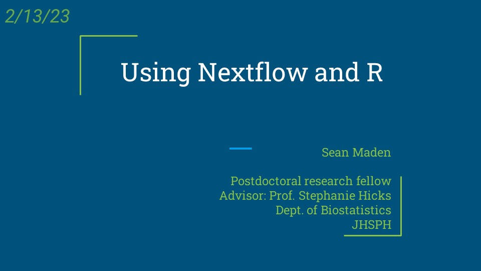

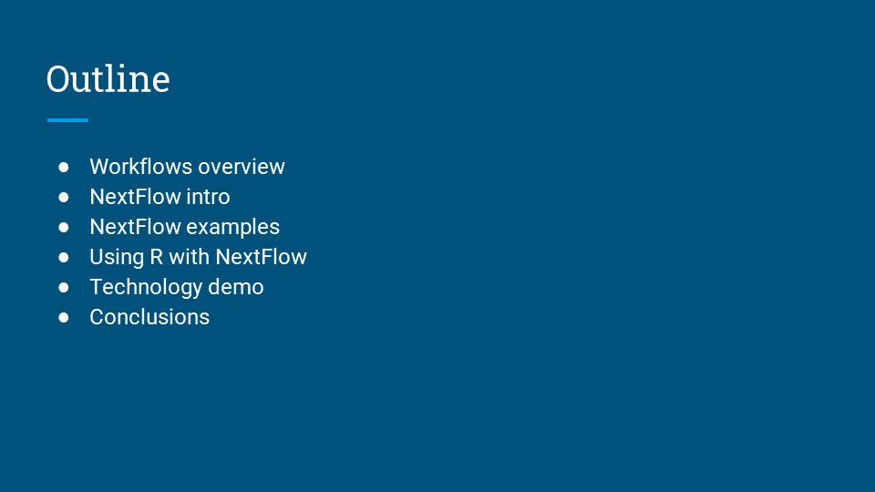

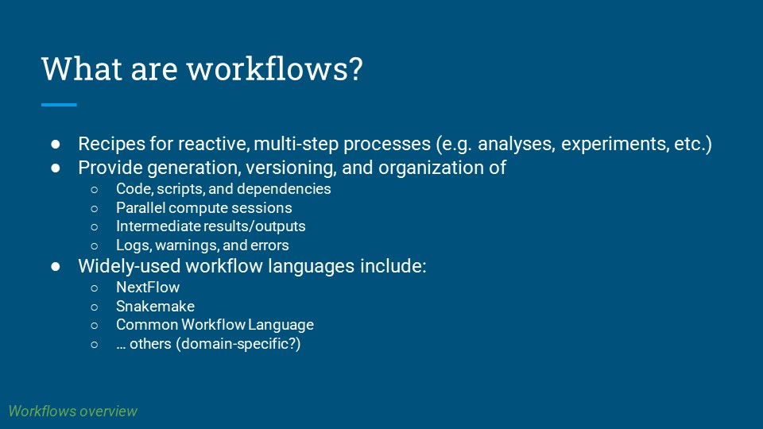

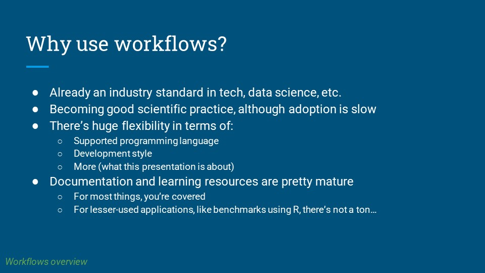

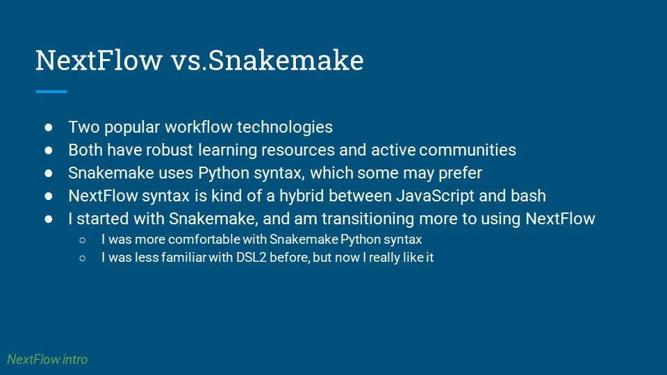

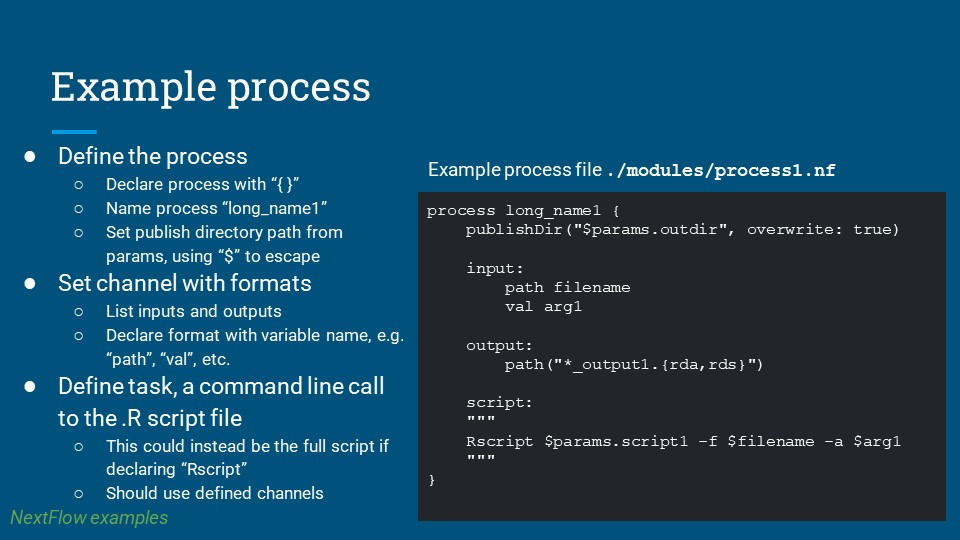

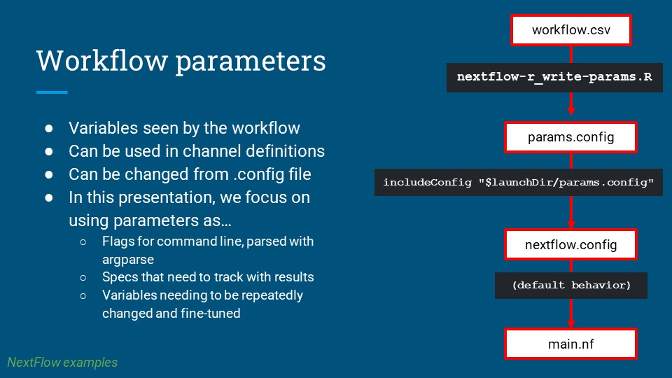

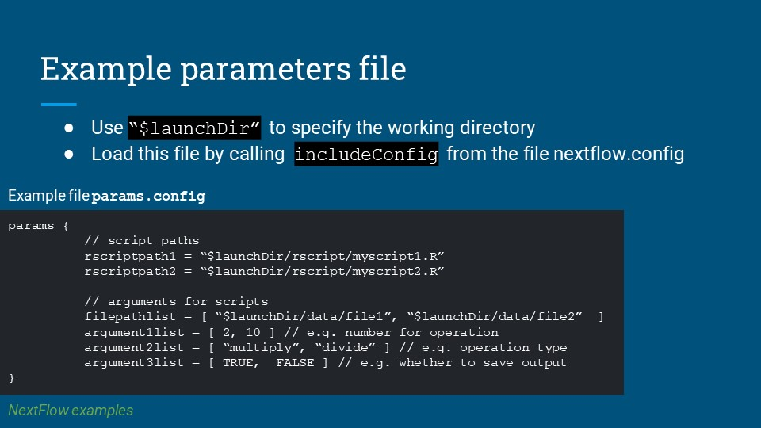

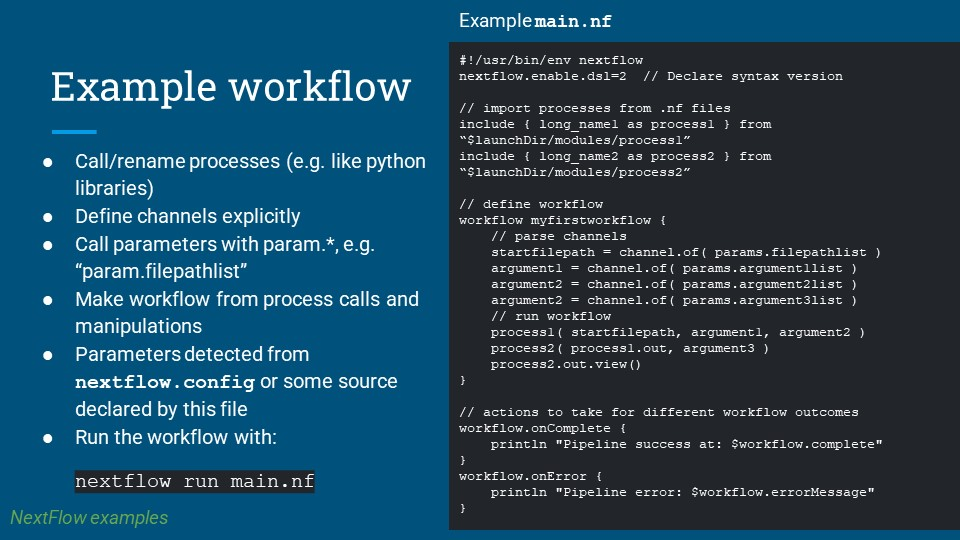

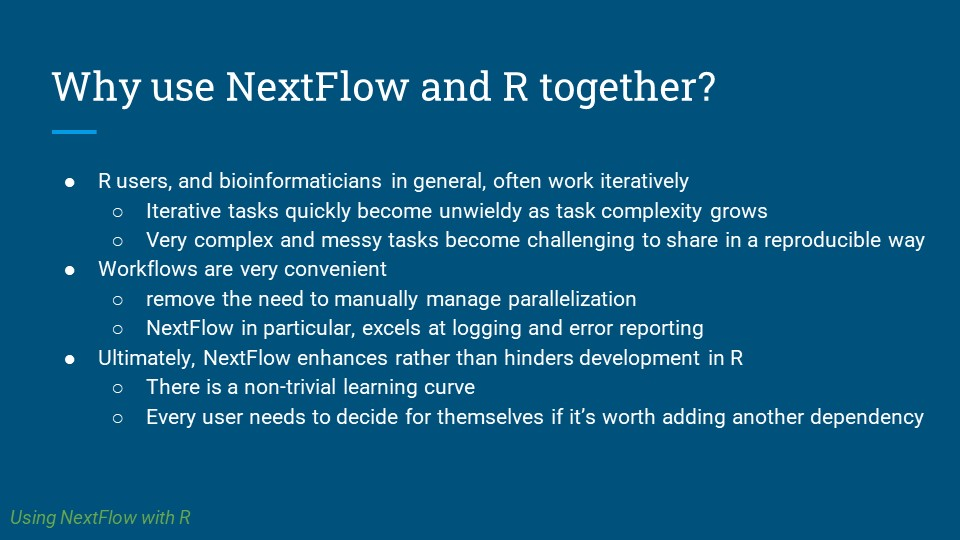

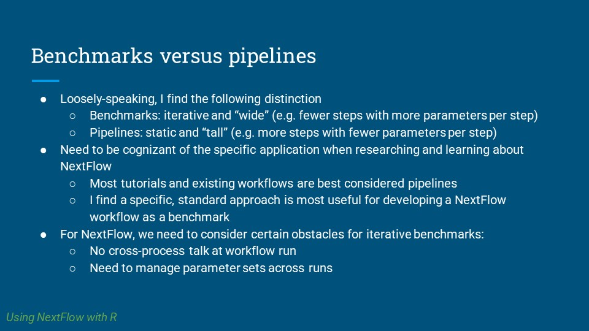

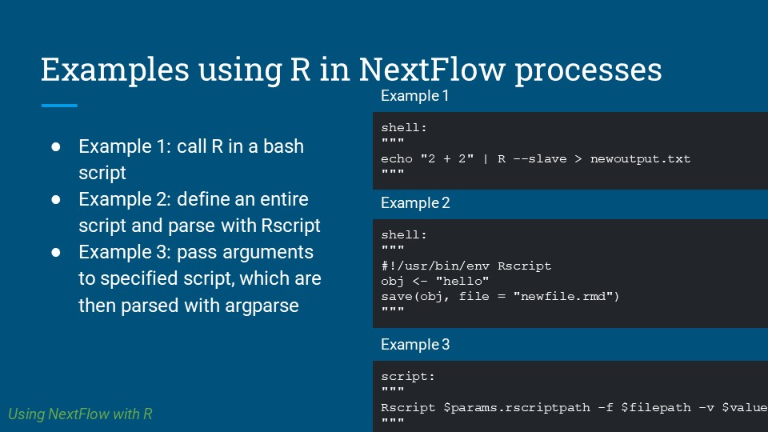

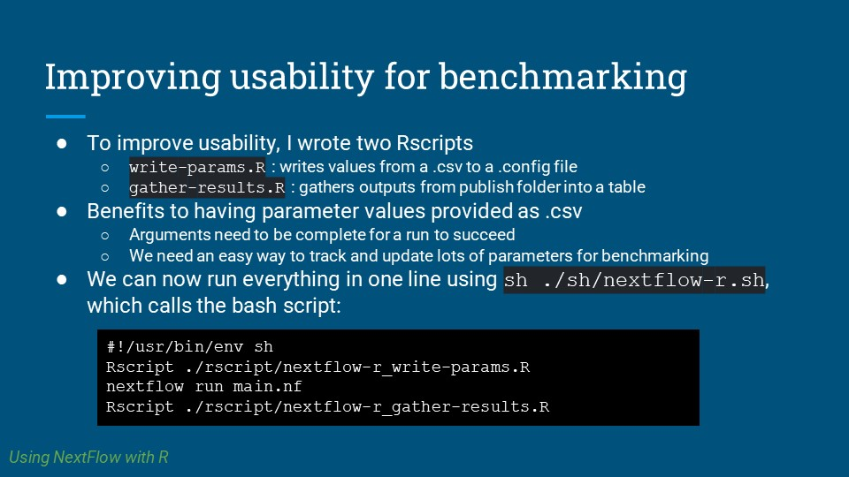

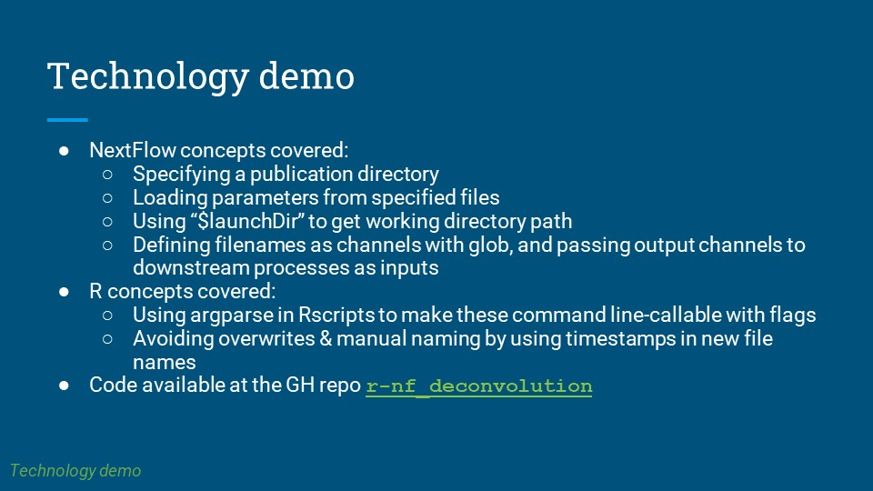

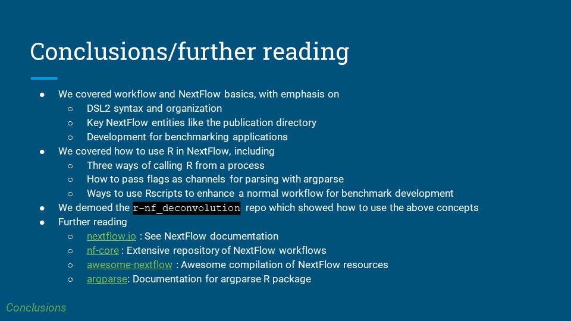

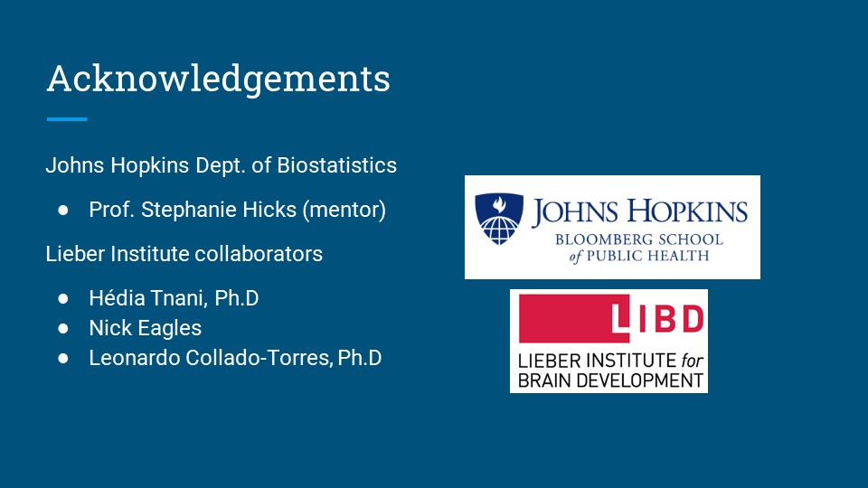